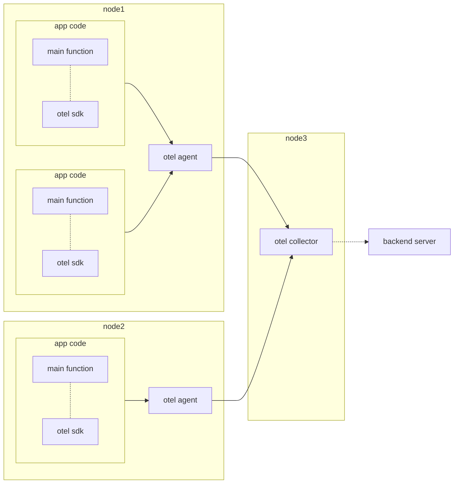

# 在 k8s 上部署 OpenTelemetry Collector - 使用 Manifest
## 概要
`otel` 提供了 `operator`, `helm chart`, `manifest` 等三種在 `k8s` 上部署 `otelcol` 的方法，此篇文章會介紹如何使用 `manifest` 進行部署。

## 架構
### 架構圖

### 說明
`collector` 通常會採用上圖的部署方式，若是規模較小或初次安裝測試，可以不安裝 `otel agent`，直接將遙測資料寄送至 `collector`。

### 補充
`otel-agent` 就是 `collector`，只是改為使用 `daemonset` 的方式，部署於每個節點，讓 app 就近寄送資料，再將資料轉發至主要 `collector`。

`collector` 不一定要安裝在獨立節點，示意圖為方便理解才獨立出來。
## 部署方法
### 取得 manifest
- 透過指令抓取
```sh
>>> curl -O https://raw.githubusercontent.com/open-telemetry/opentelemetry-collector/main/examples/k8s/otel-config.yaml
```
- 或是 [點我][manifest]

### 部署
- 使用指令部署
```sh
>>> kubectl apply -f otel-config.yaml
```
- 檢查是否部署成功
```sh
>>> kubectl get all
```

### 設定
雖然部署成功了，但目前的 `collector` 還沒被設定，因此是沒有任何功能的。

設定檔可以透過修改 `yaml` 中 `ConfigMap`.`otel-collector-conf` 來套用，撰寫方式請參考 [文章待更新]

## 補充
初次安裝測試時，可以將 `otel-agent` 的 `ConfigMap` 與 `DaemonSet` 移除，直接將資料寄送至 collector 以簡化測試流程。

## 參考
- [manifest]
- [安裝文件]

[安裝文件]: https://opentelemetry.io/docs/collector/getting-started/
[manifest]: https://raw.githubusercontent.com/open-telemetry/opentelemetry-collector/main/examples/k8s/otel-config.yaml