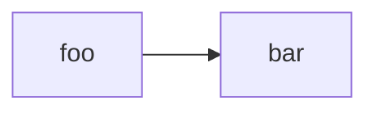
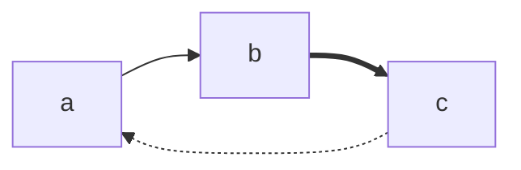
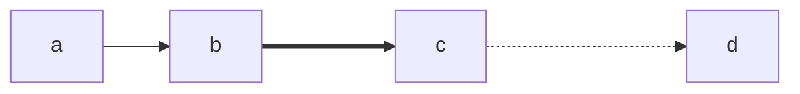
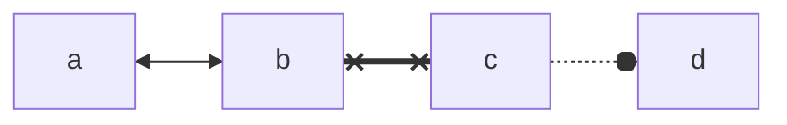
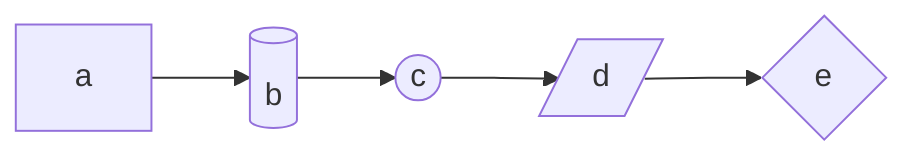
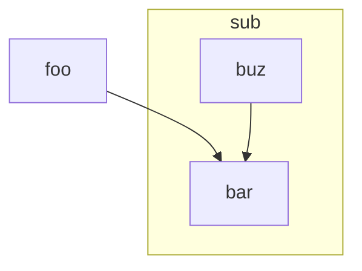
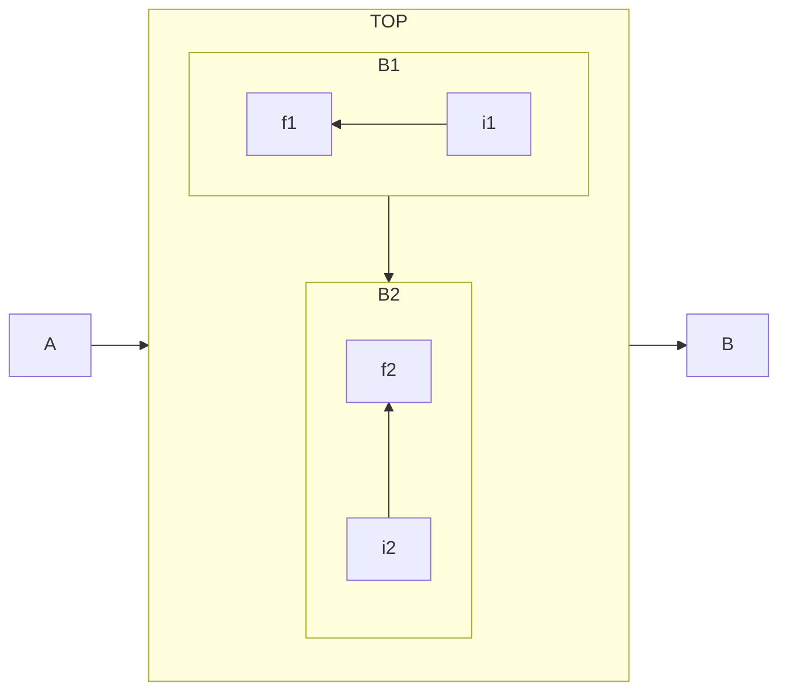

# 流程圖繪製工具 - Mermaid
## 介紹
`mermaid` 是一款以 JavaScript 編寫的開源圖表繪製工具，使用者可以透過文字標記來產生各式圖表。

mermaid 主要應用於 markdown 文件中，只要建立標記為 `mermaid` 的程式區塊，腳本就會自動將區塊轉換為以 `html` 繪製的內嵌圖表。同時由於圖表是透過腳本計算產生，因此可以輕易輸出為 `.svg`, `.png` 等格式。

## 安裝
- `mermaid` 已經與大多數 markdown 編輯環境整合，包含
    - `github`
    - `gitlab`
    - `notion`
    - `obsidian`
    - `typora`
    - `vscode`
    - `confluence`
- 若環境尚未有整合，也可以透過調用 API 或引入的方式使用
    - 參考：[使用手冊][guide]

## 使用
### 宣告 `mermaid` 區塊
建立標記為 `mermaid` 的程式區塊即可創建圖表
```
graph LR;
    foo --> bar
``` 


### 宣告圖表類型
`mermaid` 支援以下圖表種類：
- `flowchart`：流程圖
- `sequenceDiagram`：時序圖
- `classDiagram`：類別圖
- `erDiagram`：實體關聯圖
- `gantt`：甘特圖
- `mindmap`：心智圖
- 更多：參考 [說明文件][doc]

**注意**：尚未更新的環境可能不支援部分圖表或語法

### 繪製圖表
圖表類型眾多，此次僅以流程圖為例：
- 依序排序方向，使用 `graph TB;` 或 `graph LR;` 即可創建流程圖
    - `T`: top
    - `B`: bottom
    - `L`: left
    - `R`: right
```
graph LR;
    foo --> bar
``` 

- 線條種類：使用不同指定符號代替 `-`
```
graph LR;
    a --> b
    b ==> c
    c -.-> a
``` 

- 線條長度：使用 2~4 個指定符號號
```
graph LR;
    a --> b
    b ===> c
    c -...-> d
``` 

- 指標種類：以指定符號代替 `>`
```
graph LR;
    a <--> b
    b x==x c
    c -.-o d
``` 

- 節點種類：以指定符號包覆節點名稱
```
graph LR;
    a[a] -->
    b[(b)] -->
    c((c)) -->
    d[/d/] -->
    e{e}
``` 

- 新增子區塊：`subgraph ... end` 包覆新子區塊
```
flowchart TB
    foo-->bar
    subgraph ide1 [one]
        buz-->bar
    end
```

- 子區塊方向：區塊內新增 `direction TB;` 即可指定
    - **注意：若子區塊內有節點與外部連接，會造成設定被覆蓋**
```
flowchart LR
  subgraph TOP
    direction TB
    subgraph B1
        direction RL
        i1 -->f1
    end
    subgraph B2
        direction BT
        i2 -->f2
    end
  end
  A --> TOP --> B
  B1 --> B2
```

- 更多功能：參考 [官方文件][doc]

### 圖表配色
- mermaid 提供數種主題可供套用
    - default
    - neutral
    - dark
    - forest
    - base
- 若要自行修改配色，可選擇 `base` 主題後自修修改 CSS 
    - 設定參考：[官方文件][theme]

## 參考
- [安裝手冊][guide]
- [官方文件][doc]
- [主題設定][theme]


[guide]: https://mermaid.js.org/intro/n00b-gettingStarted.html
[doc]: https://mermaid.js.org/intro/
[theme]: https://mermaid.js.org/config/theming.html